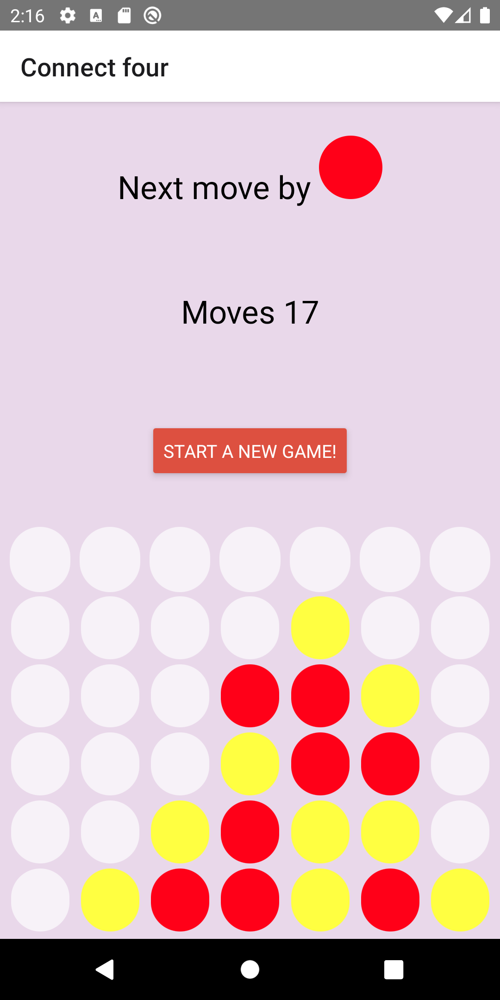
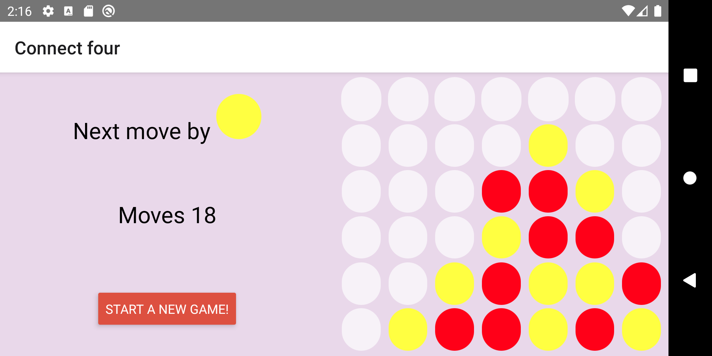
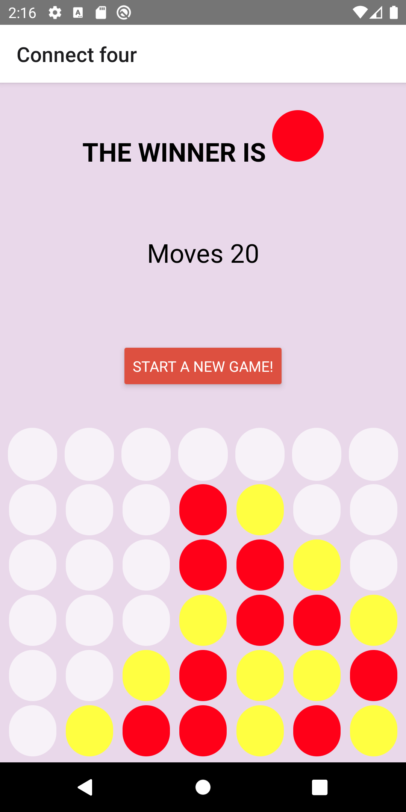
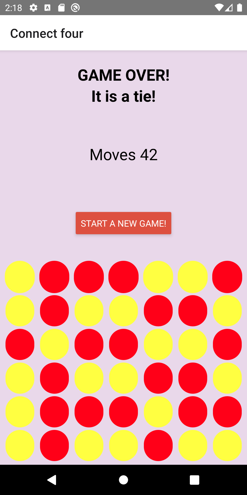

# HW1 - React Native - Connect 4

Connect four is a two-player connection board game, in which the players take turns dropping colored discs into a seven-column, six-row vertically suspended grid.

For game logic IAppContext has been used.

UI has been implemented using flexbox and styling. Game supports rotation.

Screen has been divided into two separate pieces: statistics/control and game board.

## Project setup
```
npm install
```
## Running project
```
npx react-native start
npx react-native run-android
npx react-native run-ios
```


Game on (portrait) | Game on (landscape)
------------ | ------------- 
 | 


Game over - red won | Game over - draw
------------ | -------------
 | 
